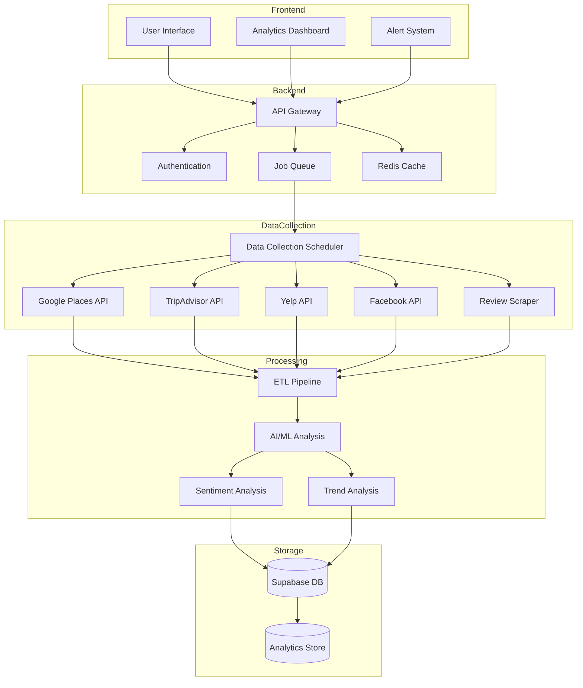
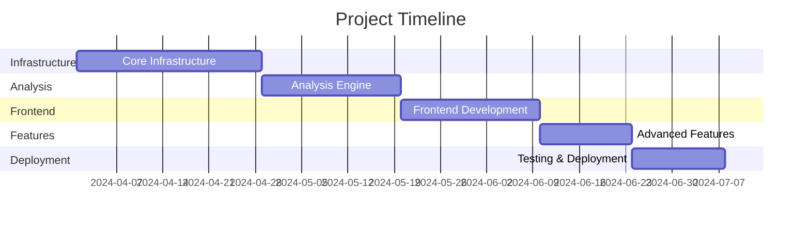

# Competitive Analysis System Implementation Plan

## System Architecture



## Implementation Phases

### Phase 1: Core Infrastructure (4 weeks)

1. **Database Schema Design**
   ```mermaid
   erDiagram
       Business ||--o{ Competitor : tracks
       Business ||--o{ Review : receives
       Competitor ||--o{ Review : receives
       Review ||--o{ Sentiment : has
       Business ||--o{ Alert : configures
       Review ||--o{ Theme : contains
       
       Business {
           uuid id
           string name
           string location
           json metadata
           timestamp created_at
       }
       
       Competitor {
           uuid id
           uuid business_id
           string name
           string platform
           json metadata
       }
       
       Review {
           uuid id
           uuid entity_id
           float rating
           text content
           timestamp created_at
           string platform
       }
       
       Sentiment {
           uuid id
           uuid review_id
           float score
           json analysis
           timestamp created_at
       }
       
       Theme {
           uuid id
           uuid review_id
           string category
           float sentiment
           int frequency
       }
       
       Alert {
           uuid id
           uuid business_id
           string type
           json conditions
           boolean active
       }
   ```

2. **Data Collection System**
   - Implement API integrations for Google Places, TripAdvisor, Yelp, and Facebook
   - Build rate-limiting and request queueing system
   - Develop fallback mechanisms and error handling
   - Set up data validation and cleaning pipeline

3. **ETL Pipeline**
   - Design standardized data format for cross-platform compatibility
   - Implement incremental data updates
   - Create data transformation workflows
   - Set up data quality monitoring

### Phase 2: Analysis Engine (3 weeks)

1. **Review Analysis**
   - Implement sentiment analysis using Google AI API
   - Develop theme extraction algorithm
   - Create rating distribution analysis
   - Build trend detection system

2. **Competitive Intelligence**
   - Develop competitor matching algorithm
   - Implement market position analysis
   - Create performance comparison metrics
   - Build benchmarking system

3. **Alert System**
   - Design alert rules engine
   - Implement real-time monitoring
   - Create notification delivery system
   - Set up alert preferences management

### Phase 3: Frontend Development (3 weeks)

1. **Dashboard Components**
   ```mermaid
   graph TD
    subgraph Dashboard
        Overview[Overview Panel]
        CompAnalysis[Competitor Analysis]
        Insights[Insights Panel]
        Alerts[Alerts Center]
    end

    subgraph Components
        Charts[Chart Library]
        Tables[Data Tables]
        Filters[Filter System]
        Export[Export Tools]
    end

    subgraph Features
        Tracking[Competitor Tracking]
        Comparison[Performance Comparison]
        Trends[Trend Analysis]
        Reports[Report Generation]
    end

    Overview --> Charts
    Overview --> Tables
    CompAnalysis --> Comparison
    CompAnalysis --> Tracking
    Insights --> Trends
    Insights --> Reports
    Alerts --> Filters
   ```

2. **Interactive Features**
   - Competitor selection and tracking interface
   - Custom date range analysis
   - Filter and search functionality
   - Data visualization components

3. **Reporting System**
   - Custom report builder
   - Export functionality (PDF, CSV, Excel)
   - Scheduled report delivery
   - Report templates

### Phase 4: Advanced Features (2 weeks)

1. **AI-Powered Insights**
   - Implement automated insight generation
   - Create recommendation engine
   - Develop predictive analytics
   - Build custom scoring system

2. **Performance Optimization**
   - Implement caching strategy
   - Optimize database queries
   - Set up data aggregation
   - Create data archival system

### Phase 5: Testing & Deployment (2 weeks)

1. **Testing Strategy**
   - Unit tests for core components
   - Integration tests for API endpoints
   - Load testing for data collection
   - End-to-end testing for user workflows

2. **Deployment Plan**
   - Set up staging environment
   - Configure monitoring and logging
   - Implement backup strategy
   - Create rollback procedures

## Technical Stack

- **Frontend**: React + TypeScript (existing)
- **Backend**: Node.js with Express
- **Database**: Supabase (PostgreSQL)
- **Cache**: Redis
- **Queue**: Bull
- **AI/ML**: Google AI API
- **APIs**: Google Places, TripAdvisor, Yelp, Facebook
- **Monitoring**: Prometheus + Grafana

## Security Considerations

1. **Data Protection**
   - Implement end-to-end encryption
   - Set up secure API authentication
   - Create role-based access control
   - Establish data retention policies

2. **Compliance**
   - Ensure GDPR compliance
   - Implement data privacy controls
   - Set up audit logging
   - Create compliance reporting

## Scalability Considerations

1. **Horizontal Scaling**
   - Design stateless services
   - Implement database sharding strategy
   - Set up load balancing
   - Create auto-scaling rules

2. **Performance**
   - Implement request rate limiting
   - Set up data partitioning
   - Create performance monitoring
   - Establish optimization thresholds

## Timeline & Milestones

Total Duration: 14 weeks



## Risk Mitigation

1. **Technical Risks**
   - API rate limiting and quotas
   - Data accuracy and consistency
   - System performance under load
   - Integration complexity

2. **Mitigation Strategies**
   - Implement robust error handling
   - Create fallback mechanisms
   - Set up monitoring and alerts
   - Establish backup data sources

## Success Metrics

1. **System Performance**
   - Data collection accuracy > 99%
   - API response time < 200ms
   - System uptime > 99.9%
   - Update latency < 1 hour

2. **User Engagement**
   - Dashboard usage frequency
   - Alert response rate
   - Report generation volume
   - Feature adoption rate